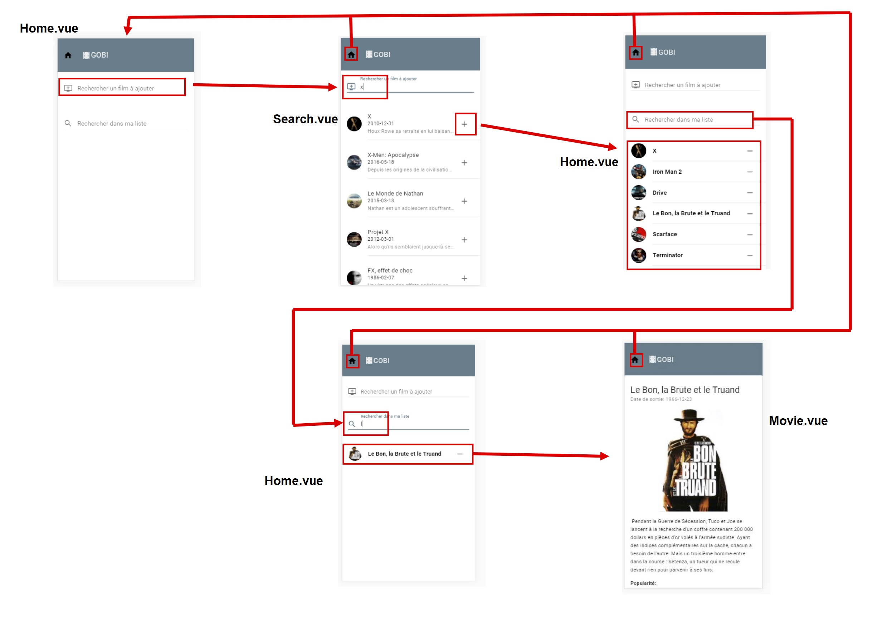

# Gobi Movie Watch List
> Projet de Sébastien Baumann et Francesco Amoroso


## Description
Possibilité de faire une liste de films que l'on aimerait regarder.
En cliquant sur un titre de film on arrive sur une page où l'on trouve le résumé du film, une barre pour indiquer sa popularité et la date de sortie.

## Outils utilisés:

+ Vue.js
+ Git / Github
+ vue-material
+ webpack
+ node.js / npm
+ The Movie DB API
+ Axios

## Installation

``` bash
npm install -g vue-cli

#Use vue-cli to create a new project using the webpack template
vue init webpack movielist
code .

#Install dependencies
npm install

#Start the development server
npm run dev

# build for production with minification
npm run build

# build for production and view the bundle analyzer report
npm run build --report

# Install material design for vue
npm install vue-material --save

# Install axios to use the api
npm install axios --save
```
## Architecture de l'application

L'architecture de notre application est la suivante:
+ App.vue (Squelette de l'application)
+ Home.vue (affichage de la liste de films, fonctions de recherche de film et fonction de filtre de la liste de films personnelle)
+ Search.vue (Permet de rechercher un film grâce à l'API The Movie DB)
+ Movie.vue (détails d'un film se trouvant dans la liste)


Le fichier détaillé ainsi ques les captures d'écran se trouvent dans le dossier "documents"

## Problèmes rencontrés

### Assimilation des différents langages, plugins et API
  ### Solution:
  * Lire les différentes documentations mises à disposition sur le web.

### Utilisation de l'API "The Movie DB" en dehors du réseau de l'école
  ### Solution:
  * Nous avons crée un compte sur leur site pour obtenir une clé d'authentification et maintenant on peut utiliser notre application depuis n'importe où.


## Retour d'expérience

+ C'était vraiment intense, car nous n'avons pas eu beaucoup de temps entre l'apprentissage des différentes technologies et leur mise en pratique.

+ Travailler avec Github est vraiment très pratique, même si ça demande un certain apprentissage une fois les principes de base maitrisés, c'est un outil puissant pour travailler en équipe.

### Améliorations

+ Nous souhaitons dans le futur, améliorer cette application en ajoutant des fonctionnalités supplémentaires.

  + Choix de la langue pour les titres et les résumés des films.
  + Géolocalisation et propositions de séances au cinéma selon notre position et les films se trouvant dans la liste personnelle.


